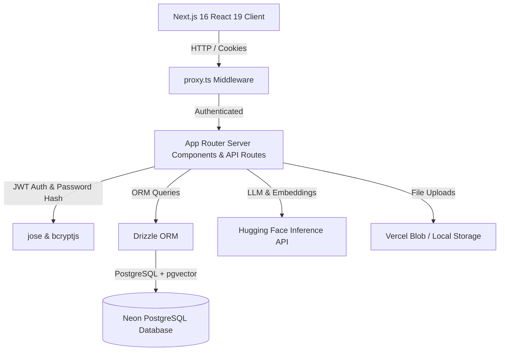

# HealthInsight Product Requirement Document (PRD)

## 1. Executive Summary & Vision

**HealthInsight** is an enterprise-grade Clinical & Population Health Data Intelligence platform designed to accelerate medical research, streamline clinical document ingestion, automate structured dataset analysis, and provide grounded AI assistant capabilities while preserving data privacy and compliance.

The platform bridges the gap between unstructured clinical narratives (medical reports, trial outcomes, patient summaries) and structured epidemiological datasets (CSV population metrics) through secure Retrieval-Augmented Generation (RAG) and automated statistical computation.

---

## 2. Target User Personas & RBAC Hierarchy

HealthInsight implements a granular Role-Based Access Control (RBAC) model across four key user personas:

| Role | Access Level | Primary Responsibilities |
| :--- | :--- | :--- |
| **Admin (`ADMIN`)** | Full Control | Workspace management, user permissions, audit trail reviews, system configuration. |
| **Programme Manager (`PROGRAMME_MANAGER`)** | Management & Write | Uploading datasets & clinical documents, building cohort reports, profile management. |
| **Lead Researcher (`RESEARCHER`)** | Data & AI Analysis | Ingesting documents, executing AI RAG queries, running dataset statistics, document comparison. |
| **Stakeholder Viewer (`VIEWER`)** | Read-Only | Viewing published reports, dataset summaries, and workspace dashboards. |

---

## 3. Key Feature Specifications

### 3.1. User Profile Management & Authentication
- **Fixed Email Identity:** User email addresses are permanently tied to account registration and cannot be modified for audit integrity.
- **Editable Profile Attributes:** Users can update their display name and profile picture (avatar upload up to 5MB, stored via Vercel Blob or local storage fallback).
- **Password Management:** Secure password update mechanism requiring verification of the current password before applying a new bcrypt-hashed password (minimum 6 characters).
- **Session Security:** Stateless JWT cookies signed via `jose` with 7-day expiration.

### 3.2. Route Protection & Proxy Middleware (`proxy.ts`)
- **Network Boundary Protection:** Implements Next.js 16 `proxy.ts` server middleware.
- **Route Guarding:** Automatically intercepts unauthenticated or expired requests targeting `(dashboard)` routes (`/dashboard`, `/settings`, `/datasets`, `/documents`, `/reports`, `/assistant`, `/audit-logs`, `/compare`, `/team`) and redirects to `/login`.
- **Authenticated Redirection:** Automatically redirects logged-in users visiting `/login` back to the `/dashboard`.

### 3.3. Document Ingestion, PII Detection & Vector RAG
- **Multi-Format Parsing:** Supports PDF, DOCX, and TXT medical documents using `pdf-parse` and `mammoth`.
- **PII Detection:** Automatically scans text for sensitive personal health information (names, SSNs, phone numbers, dates) and highlights redaction flags.
- **Vector Search (RAG):** Extracts document chunks, generates 384-dimensional embeddings via Hugging Face (`all-MiniLM-L6-v2`), and indexes them in PostgreSQL using `pgvector`.
- **Grounded AI Answers:** Generates clinical answers using Hugging Face LLMs (`Mistral-7B-Instruct-v0.3`) with direct document page citations.

### 3.4. Structured Datasets & Epidemiological Analytics
- **CSV Data Ingestion:** Uploads population data, parses schema using `papaparse`, and calculates key statistical metrics (mean, median, standard deviation, distribution).
- **Interactive Visualizations:** Renders charts (bar charts, line graphs, scatter plots) powered by `recharts`.
- **Automated AI Insights:** Generates key findings, anomalies, and data quality metrics.

### 3.5. Audit Trail & Workspace Compliance
- **Audit Logger:** Captures every critical workspace action (`USER_LOGIN`, `USER_PROFILE_UPDATED`, `DOCUMENT_UPLOAD`, `REPORT_GENERATED`).
- **Traceability:** Logs timestamps, user email, IP/metadata, and affected resource IDs.

---

## 4. Architecture & Technical Stack

### Core Tech Stack:
- **Framework:** Next.js 16.3.6 (App Router, Server Actions, `proxy.ts`)
- **UI & Styling:** React 19, TailwindCSS v4, Lucide Icons, Recharts
- **Database:** PostgreSQL with `pgvector` extension hosted on Neon Database
- **ORM:** Drizzle ORM `1.0.0-rc.4`
- **State & Data Fetching:** TanStack React Query v5
- **AI & ML Integration:** Hugging Face Inference API (`@huggingface/inference`)
- **Authentication:** `jose` JWTs, `bcryptjs` password hashing

---

## 5. Non-Functional & Security Requirements

1. **Security:** Zero plaintext password storage, HTTP-only SameSite cookies, sanitised database queries via Drizzle ORM.
2. **Data Privacy:** PII detection preprocessing prior to sending document text to external LLM endpoints.
3. **Performance:** Sub-second vector similarity retrieval and cached TanStack Query state updates.
4. **Reliability:** Built-in seed fallback data for demo accounts and offline local file storage fallback when Vercel Blob tokens are absent.
